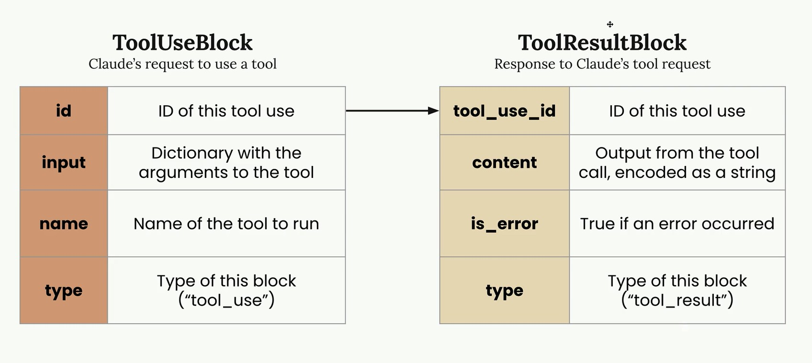
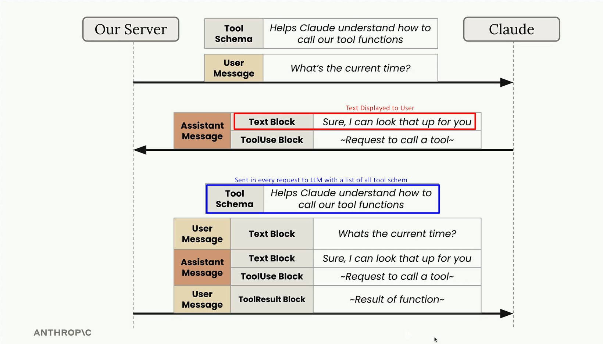
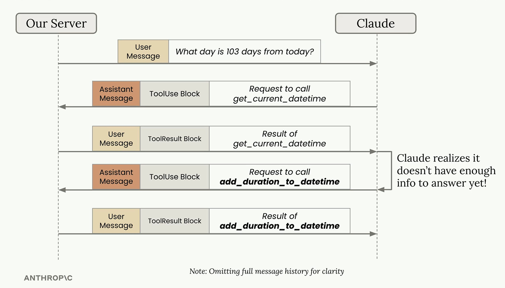

# Tools

Extend Claude's capabilities by giving it access to external functions - real-time data, system integrations, and dynamic actions.

## Prerequisites

- Python 3.10+
- `anthropic` and `python-dotenv` packages
- An Anthropic API key in a `.env` file (`ANTHROPIC_API_KEY=sk-...`)

---

## Notebooks

### 1. Basic Flow

Walk through the complete tool use lifecycle step by step: define a Python function, write a JSON schema, call the API with `tools=`, extract the `ToolUseBlock`, run the function locally, and return the result as a `tool_result` message.

**Key concepts:** tool function, JSON schema, `tools` parameter, `ToolUseBlock`, `tool_result`, `tool_use_id`, `stop_reason="tool_use"`, `ToolParam`

---

### 2. Multi-turn Conversation

Automate tool calling in a loop so Claude can make multiple tool calls across turns without manual intervention. Improves on the basic flow with robust helper functions that handle `Message` objects, a `run_tools()` dispatcher, and a `run_conversation()` loop that continues until Claude stops requesting tools.

**Key concepts:** `run_conversation()` loop, `run_tools()` dispatcher, `stop_reason` check, `text_from_message()`, multiple simultaneous tool calls, `json.dumps()` for tool output

---

## Key Benefits

- **Real-time information access** - fetch live data via APIs (time, weather, prices)
- **External system integration** - connect to databases, APIs, and services
- **Dynamic responses** - turn static LLM output into actions with real-world effects

## Project Example

- **Goal:** Teach Claude to set reminders
- **Problems:** Limited time awareness, date calculation issues, no built-in reminder capability
- **Solution:** Build tools for current time, date arithmetic, and reminder setting - then give Claude access to them

---

## Tool Use Flow

### Steps

1. **Write a tool function** - a Python function Claude can trigger
    - Use well-named, descriptive arguments
    - Validate inputs and raise meaningful errors (Claude can retry based on error messages)
2. **Write a JSON schema** - tells the LLM what arguments the function requires
    - Include a clear description of what the tool does, when to use it, and what it returns (3-4 sentences)
    - Provide detailed descriptions for each argument
    - _Tip: Use Claude to generate a JSON schema based on best practices_
3. **Call the API with the schema** - pass `tools=[list of tool schemas]` when calling `messages.create()`
    - Based on the input prompt, the LLM may respond with one or more `ToolUseBlock` items inside `content[]`
    - The response will have `stop_reason="tool_use"` when a tool call is requested
4. **Run the tool** - execute the function locally with the inputs Claude provided
5. **Return the result** - send a `tool_result` message back as a user message and call Claude again

### `ToolUseBlock` and `ToolResultBlock`



<table>
<tr>
<th width="50%">1. Tool Use (Assistant)</th>
<th width="50%">2. Tool Result (User)</th>
</tr>
<tr>
<td valign="top">

```json
{
  "type": "tool_use",
  "id": "toolu_12345",
  "name": "get_weather",
  "input": {
    "location": "London",
    "unit": "celsius"
  }
}
```

</td>
<td valign="top">

```json
{
  "type": "tool_result",
  "tool_use_id": "toolu_12345",
  "content": "Sunny, 22C",
  "is_error": false
}
```

</td>
</tr>
</table>

> **Note:** The `tool_use_id` in the result must match the `id` from the corresponding `ToolUseBlock`. This is how the API links results back to requests.

### Tool Request Flow



---

## Multiple Tool Calls

When Claude needs multiple pieces of information, it can request several tools in a single response (e.g., asking for both current time and current date simultaneously). Each `ToolUseBlock` gets its own `tool_result` in the reply.

### Automated Multi-turn Loop

Instead of manually handling each tool call, wrap the conversation in a loop:

1. Send the initial message with `tools=` provided
2. Check `response.stop_reason` - if `"tool_use"`, extract and run all `ToolUseBlock` requests
3. Collect results into `tool_result` blocks (one per tool call) and add them as a user message
4. Call the API again with the updated conversation history
5. Repeat until `stop_reason` is no longer `"tool_use"` - Claude's final text response is ready



### Key Implementation Details

- **`run_tools(message)`** - iterates over all `ToolUseBlock` items in a response, calls the matching function, and returns a list of `tool_result` dicts (with `is_error: true` on exceptions)
- **`run_conversation(messages)`** - the outer loop that alternates between calling the API and dispatching tool calls until Claude produces a final text answer
- **`text_from_message(message)`** - extracts and concatenates all `TextBlock` content from a response, filtering out tool use blocks
- **Helper functions** (`add_user_message`, `add_assistant_message`) accept both raw strings and `Message` objects, making it easy to append either user input or full API responses to the conversation history
