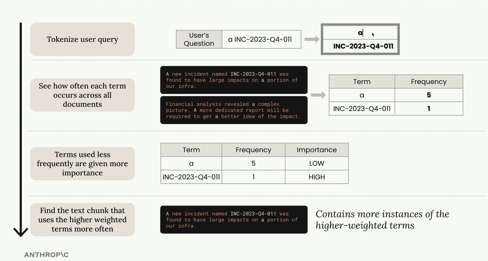

# RAG (Retrieval-Augmented Generation)

Ground Claude's responses in your own documents - retrieve relevant context at query time and inject it into the prompt.

## Prerequisites

- Python 3.10+
- `anthropic` and `python-dotenv` packages
- Anthropic API key in a `.env` file (`ANTHROPIC_API_KEY=sk-...`)
- VoyageAI API Key (`VOYAGE_API_KEY=pa-...`)

---

## Why RAG?

LLMs have a training cutoff and no access to private or domain-specific data. RAG solves this by retrieving relevant documents at query time and injecting them into the prompt as context.

**Pros:**
- No retraining required - update the document store, not the model
- Responses are grounded in your actual data, reducing hallucinations
- Works with private, proprietary, or frequently changing content

**Cons:**
- Retrieval quality directly limits answer quality - bad retrieval means bad answers
- Adds latency from the retrieval step
- Long retrieved chunks can push context windows to their limits

---

## Topics

### 1. Chunking Strategies

Before anything can be retrieved, documents must be split into chunks - small enough to fit in context, large enough to be meaningful.

Three core strategies:

- **Size-based chunking** - split by fixed character or token count, optionally with overlap to avoid cutting sentences mid-thought.
- **Structure-based chunking** - split on natural document boundaries (paragraphs, headings, code blocks, markdown sections).
- **Semantic chunking** - embed each sentence, measure similarity between adjacent sentences, and split where similarity drops - keeps topically coherent content together.

**Key concepts:** fixed-size chunking, overlap, structure-aware splitting, semantic similarity, embedding-based segmentation

---

### 2. Embedding

Embeddings convert text into dense numeric vectors that capture semantic meaning. Similar meaning produces similar vectors, regardless of exact wording.

Why embeddings matter for RAG:
- Enable semantic search - find relevant chunks even when the query uses different words than the document
- The vector space is the retrieval index - every chunk becomes a point in high-dimensional space
- Dimensions vary by model (e.g. 1536 for `text-embedding-3-small`, 3072 for `text-embedding-3-large`) - more dimensions generally mean finer-grained similarity but higher storage cost

**Key concepts:** vector representation, semantic similarity, embedding dimensions, embedding models

---

### 3. VectorDB

Putting the full RAG pipeline together: embed all document chunks, store them in a vector database, then retrieve the most relevant chunks at query time and assemble a prompt for Claude.

#### Full RAG Flow

1. **Ingest** - chunk documents, embed each chunk, store in the vector DB
2. **Query** - embed the user question using the same model
3. **Retrieve** - find the closest chunk vectors to the query vector
4. **Assemble** - build a prompt with the retrieved chunks as context
5. **Generate** - call Claude with the assembled prompt

#### Cosine Similarity

Retrieval ranks chunks by how close their vectors are to the query vector. Cosine similarity measures the angle between two vectors - 1.0 means identical direction, 0 means orthogonal, -1 means opposite:

$$\text{cosine similarity}(A, B) = \frac{A \cdot B}{\lVert A \rVert \times \lVert B \rVert}$$

Most embedding models output normalized vectors (magnitude = 1), so dot product and cosine similarity are equivalent - cosine is just a dot product when vectors are unit-length.

**Cosine distance** is the complement: `cosine_distance = 1 - cosine_similarity`. It converts similarity into a proper distance metric (0 = identical, 2 = opposite) useful for threshold-based filtering and clustering.

#### Retrieval Strategies

| Strategy | How it works | When to use |
|---|---|---|
| Top-k | Return the k highest-similarity chunks | Simple, fast, always returns results |
| Threshold | Return only chunks above a similarity cutoff | Avoids injecting irrelevant context |
| Reranking | Re-score shortlisted chunks with a cross-encoder | Higher precision when latency allows |

#### Prompt Assembly

Retrieved chunks are inserted into the prompt as a `Context` block before the user question. Claude is instructed to answer only from the provided context, reducing hallucination.

**Key concepts:** vector database, cosine similarity, dot product, top-k retrieval, threshold retrieval, reranking, prompt assembly, RAG pipeline

---

### 4. BM25 Lexical Search

BM25 (Best Match 25) is a classic keyword-based ranking algorithm. Unlike vector search, it does not require an embedding model - it scores documents based on exact term frequency and document length normalization.

How BM25 scores a document for a query:
- Counts how often each query term appears in the document (term frequency)
- Penalizes very long documents so they don't dominate just by having more words
- Boosts terms that are rare across the entire corpus (inverse document frequency)
- Applies saturation so repeated terms have diminishing returns

BM25 excels at exact-match queries (product codes, names, technical terms) where vector search may struggle because semantically similar vectors don't always preserve specific tokens.

**Key concepts:** BM25, term frequency, inverse document frequency, document length normalization, lexical search, keyword matching

---

### 5. Multi-Index RAG

Combines vector search and BM25 lexical search into a single retrieval pipeline using Reciprocal Rank Fusion (RRF). Each method independently ranks all chunks; RRF merges the two ranked lists into a single fused ranking.

#### Reciprocal Rank Fusion Formula

$$\text{RRF score} = \sum_{\text{index}} \frac{1}{k\_rrf + \text{rank}}$$

Where:
- `d` is a document (chunk)
- `rank_i(d)` is the rank of document `d` in index `i` (1 = top result)
- `k` is a smoothing constant (k = 60 is the standard default; the notebooks use k = 1 for clearer score differences)
- The sum runs over all `n` indexes (vector + BM25 in the two-index case)

A chunk that ranks highly in both indexes accumulates score from both terms and rises to the top of the fused list. A chunk that only one method finds is penalized by the missing contribution.

#### Example: RRF Score Calculation (k = 1)

| Chunk | Rank (Vector) | Rank (BM25) | RRF Score | Final Rank |
|---|---|---|---|---|
| Chunk A | 1 | 3 | 1/(1+1) + 1/(1+3) = 0.500 + 0.250 = 0.750 | 1 |
| Chunk B | 2 | 1 | 1/(1+2) + 1/(1+1) = 0.333 + 0.500 = 0.833 | - |
| Chunk C | 3 | 2 | 1/(1+3) + 1/(1+2) = 0.250 + 0.333 = 0.583 | 3 |

> With k = 1, score differences are amplified, making the example easier to read. Production systems typically use k = 60 to reduce the influence of rank differences near the top.

**Key concepts:** multi-index retrieval, hybrid search, Reciprocal Rank Fusion (RRF), rank fusion, smoothing constant k, vector search, BM25, combined ranking
